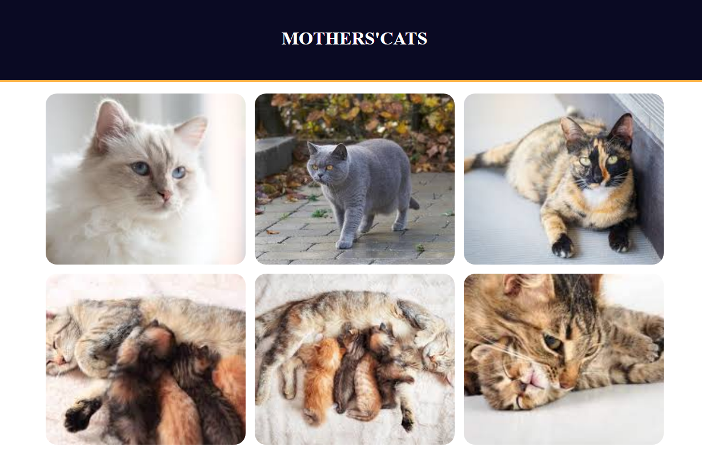

# GALERIA DE FOTOS

Página HTML e CSS com uso de Flexbox.

## 🚀 Começando

Essas instruções permitirão que você obtenha uma cópia do projeto em operação na sua máquina local para fins de desenvolvimento e teste.


### 🔩 Analise os testes de ponta a ponta

Explique que eles verificam esses testes e porquê.

```
Dar exemplos
```

### ⌨️ Tela



## 📦 website

<a>href="https://tomcontatto.github.io/galeria_fotos/">https://tomcontatto.github.io/galeria_fotos/</a>

## 🛠️ Tecnologias e ferramentas usadas

Mencione as ferramentas que você usou para criar seu projeto

* [HTML](http://www.dropwizard.io/1.0.2/docs/) - Linguagem de marcação de hipertexto.
* [css](https://maven.apache.org/) - Gerente de Dependência
* [visual Studio Code](https://code.visualstudio.com/) - Usada para gerar RSS

## 🖇️ Repositório

https://github.com/tomcontatto/galeria_fotos.git


## ✒️ Autor

Mencione todos aqueles que ajudaram a levantar o projeto desde o seu início

* **Um desenvolvedor** - *Trabalho Inicial* - [desenvolvedor](https://github.com/tomcontatto)
